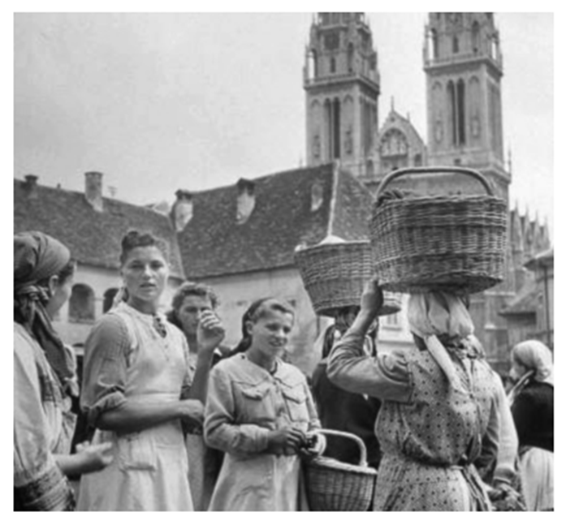
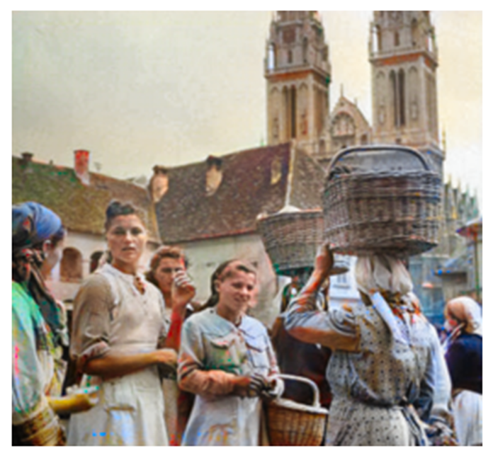
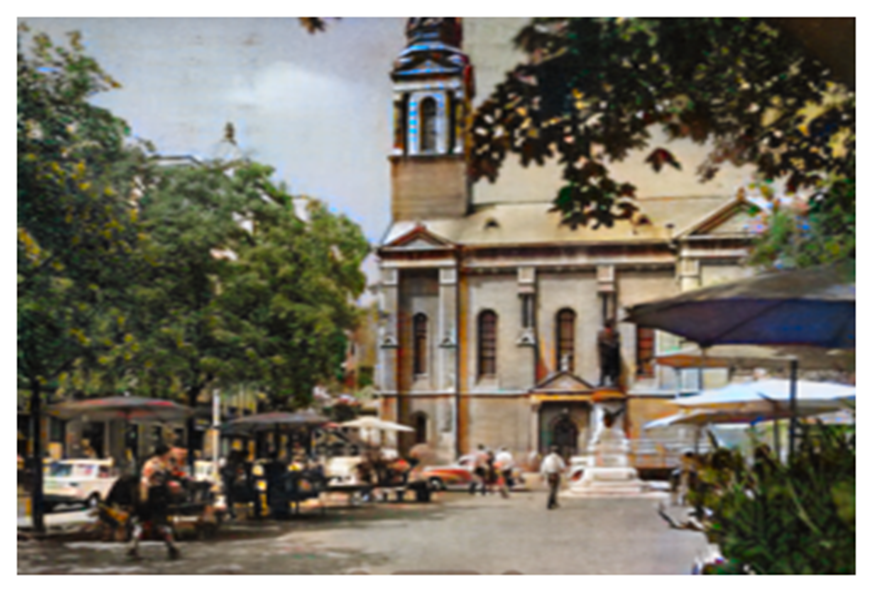
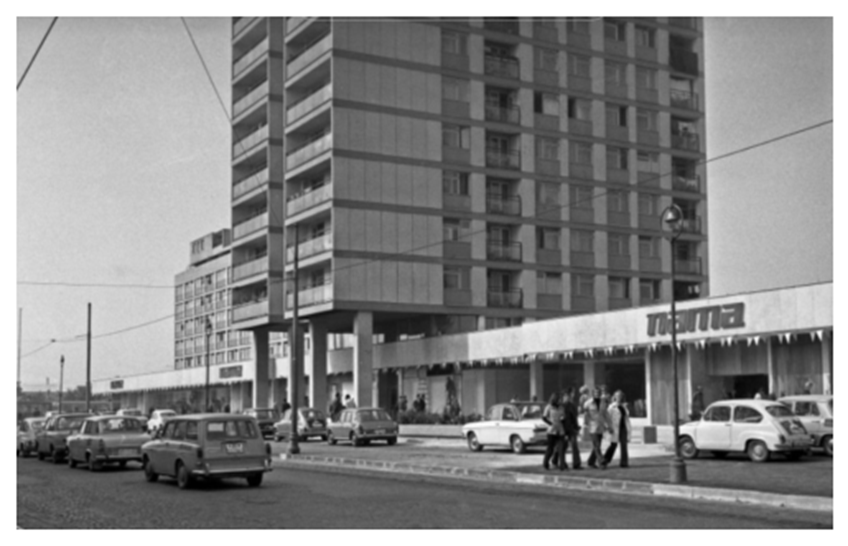
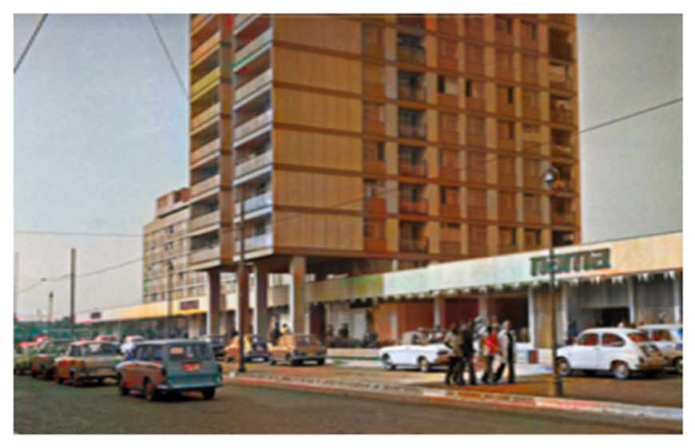
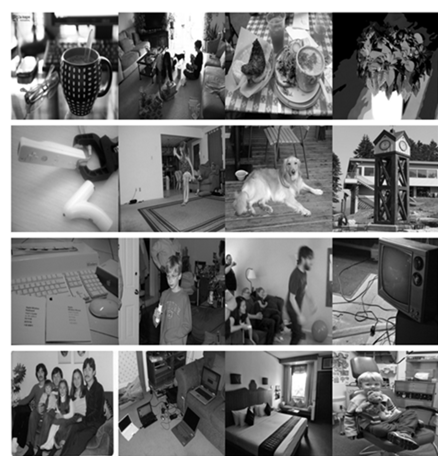
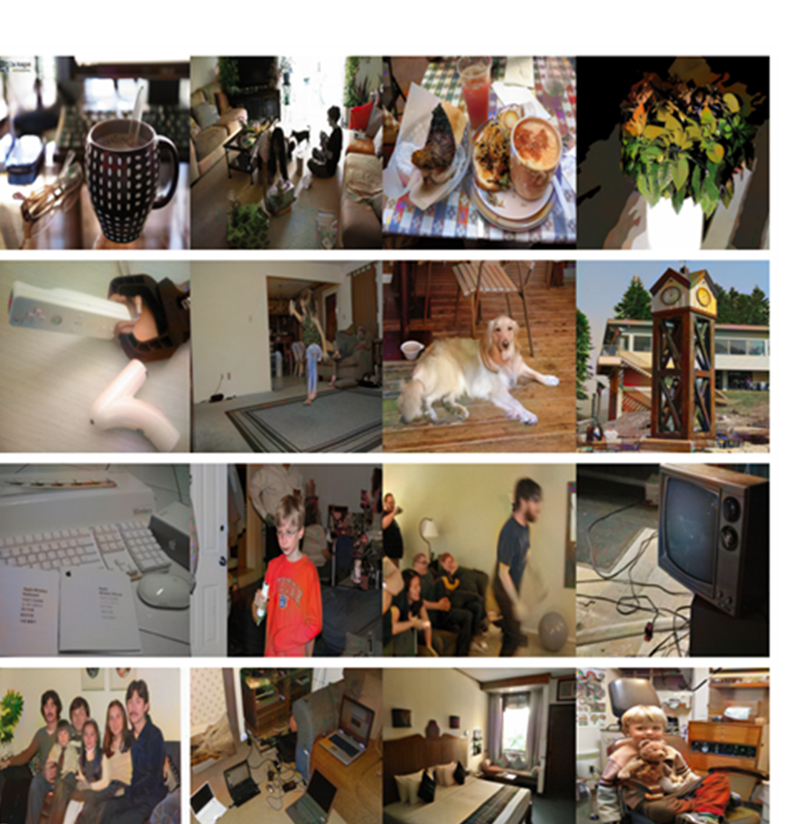
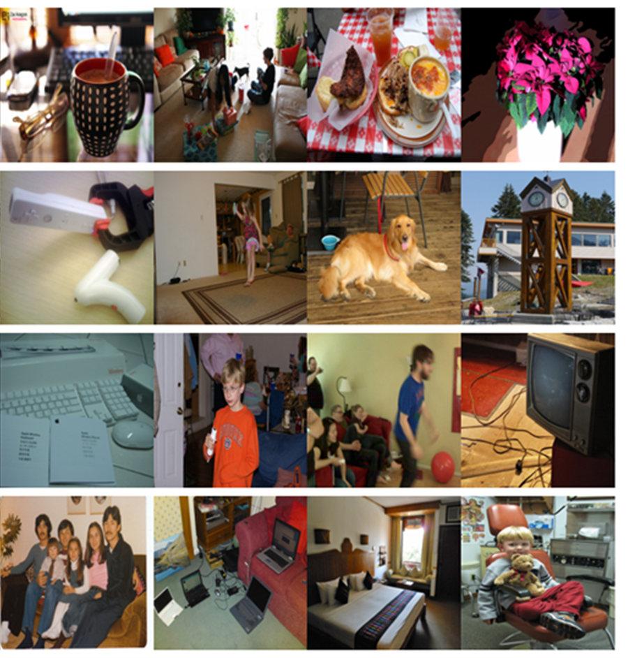

# Pix2Pix GAN for Image Colorization 🎨🖼️

This project was developed as part of the **[Deep Generative Modeling (Deep Learning 2)](https://www.fer.unizg.hr/en/course/deelea2)** course. It involves training a **Pix2Pix GAN** for the task of **image colorization**.

## Project Structure 📂
- **`src/train.ipynb`** – Notebook for training the GAN(s) 🏋️‍♂️.
- **`src/evaluate.ipynb`** – Notebook for evaluating model performances on different metrics 📊.
- **`results/visualisation.ipynb`** – Notebook for generating graphs and visualizations 📈.
- **`results/`** – Folder containing saved graphs and other outputs 🗂️.
- **`results/report-cro.pdf`** – A detailed report (in Croatian 🇭🇷) explaining the methodology and results 📄.
- **`training_logs/`** – Folder containing losses and colorization attempts troughout the epochs. ⏳📉🖼️

## Dependencies 📦
Ensure you have all required dependencies installed:

```bash
pip install -r requirements.txt
```
## Report
For a comprehensive explanation of the project, refer to [report-cro.pdf](./results/report-cro.pdf)

## Results Examples
Here are some colorization examples on historical black-and-white photographs achieved using our LS-GAN model:
<div style="display: flex; gap: 10px;">
  
  
</div>
<br>


<div style="display: flex; gap: 10px;">
  
  
</div>

<br>

<div style="display: flex; gap: 10px;">
  
  
</div>

<br>

And here are some examples taken from the COCO dataset:
<div style="display: flex; gap: 10px; justify-content: center;">
   <figure style="text-align: center;">
    
    <figcaption>Black and White</figcaption>
  </figure>
   <figure style="text-align: center;">
    
    <figcaption>Colorized</figcaption>
  </figure>
   <figure style="text-align: center;">
    
    <figcaption>Ground Truth</figcaption>
  </figure>
</div>